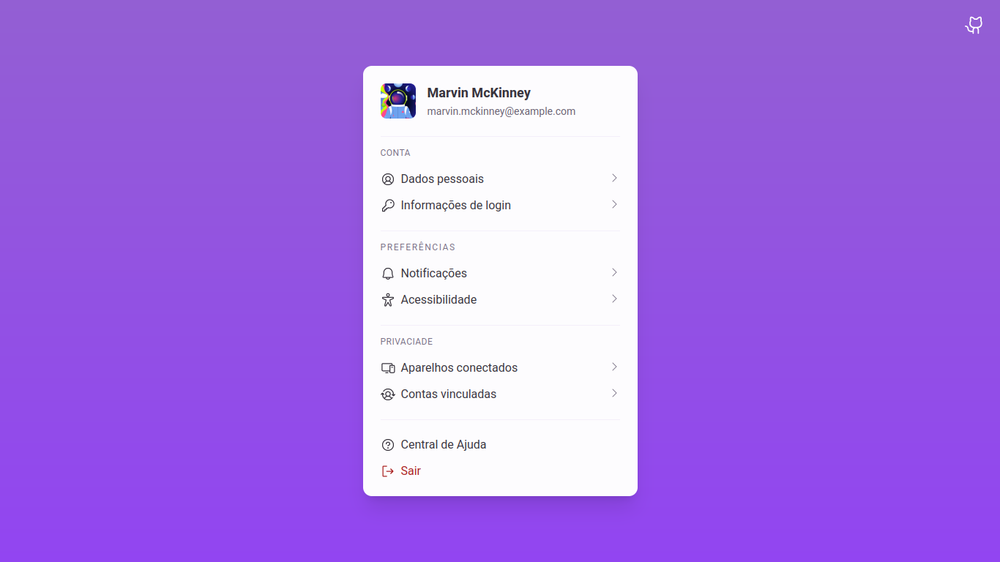

Projetos semanais [#boraCodar](https://www.rocketseat.com.br/boracodar) da
[Rocketseat](https://www.rocketseat.com.br/).

Projetos feitos utilizando as seguintes tecnologias:

- [Astro](https://astro.build/)
- [Alpine.js](https://alpinejs.dev/)
- [UnoCSS](https://unocss.dev/)

Além disso, [Phosphor Icons](https://phosphoricons.com/) como principal biblioteca de ícones.

### Projetos

|  #  | Projeto                        |                                                      Desafio                                                       |                                                   Preview                                                   |
| :-: | :----------------------------- | :----------------------------------------------------------------------------------------------------------------: | :---------------------------------------------------------------------------------------------------------: |
| 023 | Formulário Multi Step          |     [:link:](https://www.rocketseat.com.br/boracodar/desafios-anteriores/um-formulario-multi-step-desafio-23)      |  |
| 022 | Componente de Profile Settings | [:link:](https://www.rocketseat.com.br/boracodar/desafios-anteriores/um-componente-de-profile-settings-desafio-22) |  |
